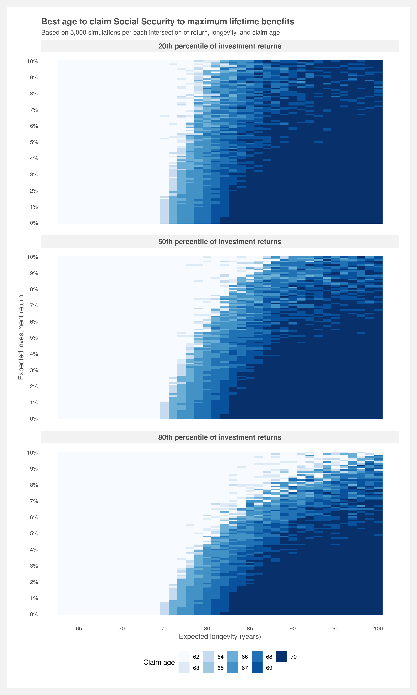

# Social-Security

A Social Security benefits calculator that optimizes for claim age based on expected investment return and one's life expectancy (longevity). It answers the question: should I claim early and invest my benefits or wait until age 70 to receive the largest amount? That depends on your investment return and longevity.

`Analyses` folder contains the full analysis, plots, and simulations  
`R` folder contains the core logic to calculate Social Security benefits  

## To-do list
- [x] Build core of the benefits calculator
- [x] Build NPV and investment functions
- [x] Build method to determine best claim age given a death age and investment retun
- [x] Double check assumptions for projecting indices
- [x] Check to see if benefits are adjusted correctly for claim age  
    
    
  
  

