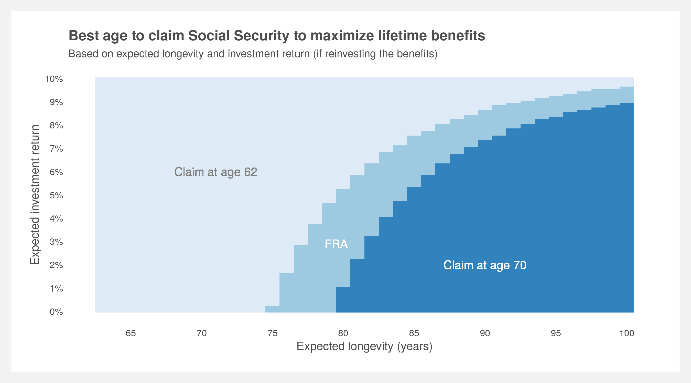
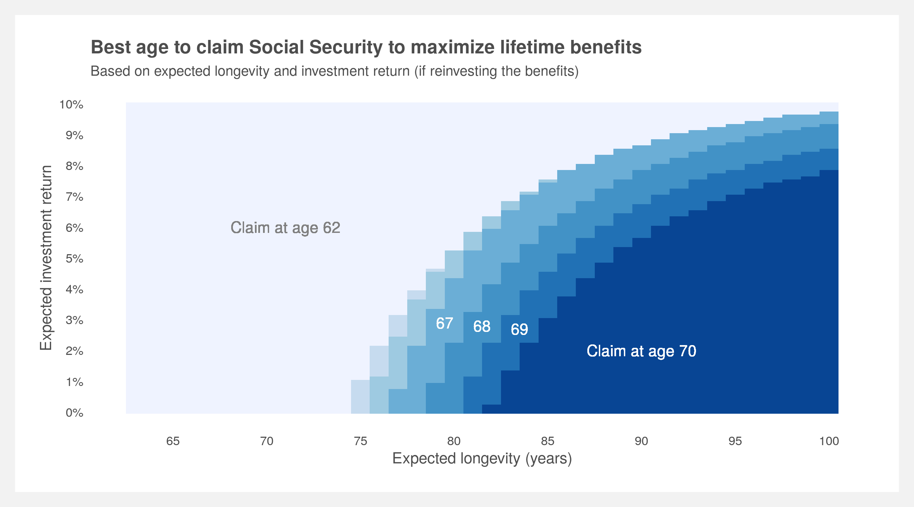

# Social-Security

Project builds a Social Security benefits calculator in R then explores the best claim age based on one's longevity and investment returns.  

## To-do list
- [x] Build core of the benefits calculator
- [x] Build NPV and investment functions
- [x] Build method to determine best claim age given a death age and investment retun
- [ ] Double check assumptions for projecting indices
- [ ] Convert benefits calculation from annual to monthly
- [ ] Check to see if benefits are adjusted corrected for claim age  
  
  

  
  
  

